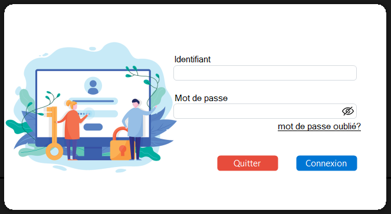

# C# Gestion Stock

C’est une application de bureau (ou application desktop) réalisée à l’aide du langage de programmation <strong>C#</strong> en utilisant la bibliothèque Windows Forms (bibliothèque d'interface utilisateur graphique) du framework <a href="https://fr.wikipedia.org/wiki/.NET" target="_blank">.NET</a>. 
Cette application permet la gestion du stock d’un magasin qui va de la gestion des produits, des catégories, des vendeurs jusqu’à la vente des produits. Ce projet fut riche d’enseignements car au-delà d’approfondir des connaissances en développement logiciel notamment via la découverte du langage C# et de l’ORM Entity Framework mais aussi le système de gestion de bases de données relationnelles (SGBDR) SQL Server de Microsoft, ce projet nous plonge dans le monde de la logistique.

## Présentation de l'application

>#### Partie Gestionnaire

>#### Vendeur

